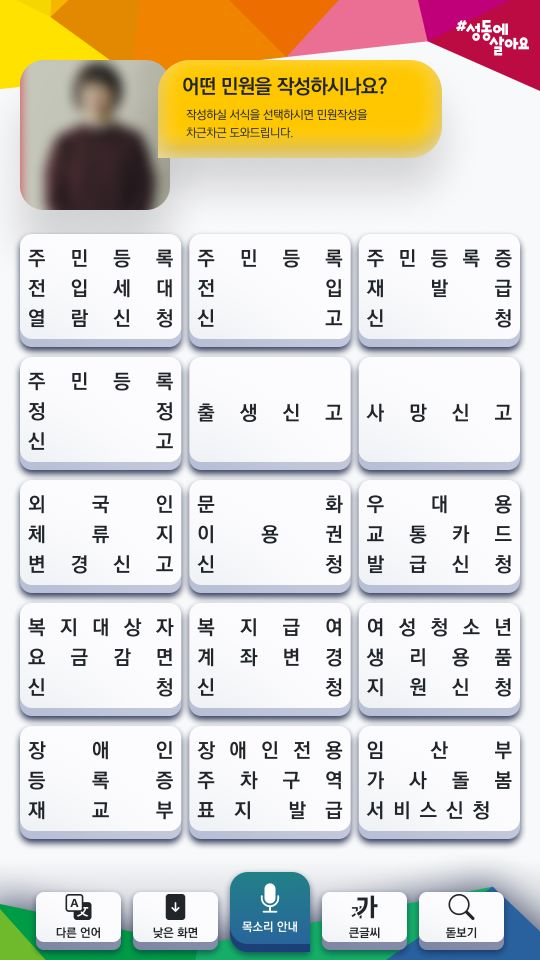
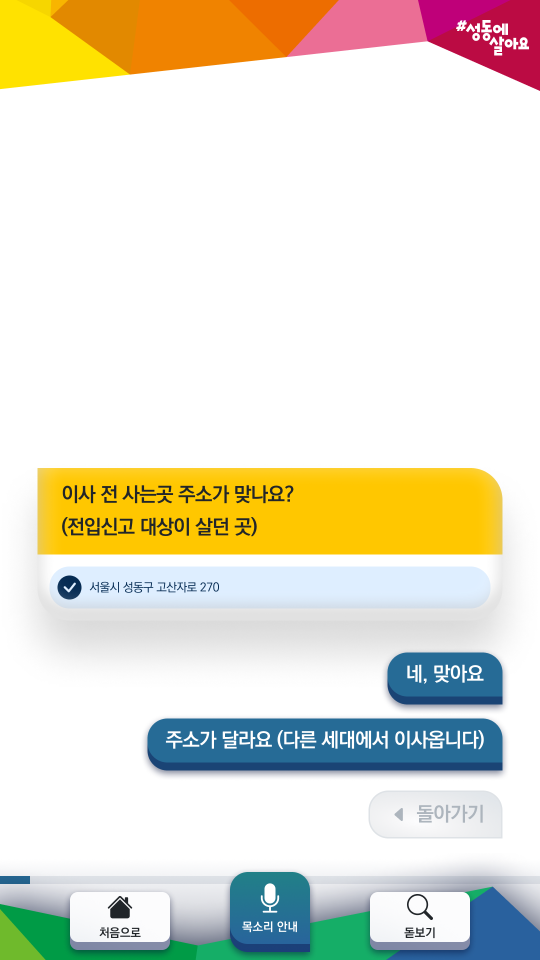
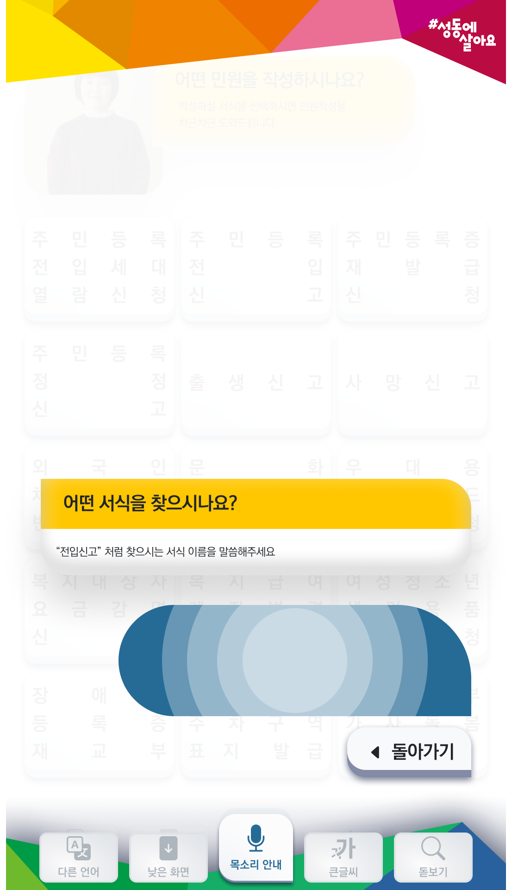

```
📅기간: 2022/07/12 ⭢ 2022/12/14
🤝고객: 성동구청
🖥️업무: UI 디자인
🎯기여도: 30%
```

## 💡 프로젝트 목표
민원서식 신청의 편리성을  향상하며, ‘장애인 차별 금지법’ 준수를 위한 배리어프리(barrier-free) 기능이 있는 민원 작성을 도와주는 키오스크 설계

요구사항:
- 시각장애인을 위한 디지털 촉지도(점자모듈), Screen-Reader 기술 적용
- 청각장애인을 위한 수어 동영상 적용
- 휠체어 사용자를 위한 하단 UI 구성(선택 버튼 하단에 위치)
- 저시력자 및 고령자를 위한 큰 글씨 UI 추가(돋보기 기능)

## 💡 접근 방법
### 키오스크에 대한 컨셉
민원서식 작성은 대부분의 사람들이 어려움을 느낍니다. 민원서식은 복수의 목적을 위해 사용되도록 만들어진 여러 입력란이 동시에 표시된 인쇄물로, 민원인의 목적에 따라 작성이 필요한 항목이 다르지만 이에따라 정보가 구분되어 표시되어있지 않기 때문입니다. 이 문제는 디지털 프로덕트인 민원서식 키오스크에서 가변적으로 필요한 정보만 제시하는 것으로 해결했습니다. 하지만 디지털 키오스크도 많은 사람들이 어려움을 느낍니다. 디지털 소외계층인 경우 학습이 필요하며, 시각장애인인 경우 터치 디스플레이를 사용하기 어렵습니다. 이는 대화형 UX 디자인과 하드웨어 설계로 해결했습니다. 키오스크가 민원인에게 업무를 시키는 것이 아니라, 1:1로 민원인과 대화하며 서류작성을 도와주는 공무원이라는 개념으로 접근했습니다. 순서대로 이어지는 대화는 인지부하를 줄일 뿐만 아니라 시각적인 요소가 없는 경우에도 동일하게 동작할 수 있는 디자인이라고 생각했습니다. 

### 배우지 않아도 되는 인터페이스
키오스크에 대해 스터디하면서 많은 공공 디지털 교육 중 하나로 키오스크 사용법 교육이 있다는 것을 알게 되었습니다. 익숙하지 않은 기기는 학습이 필요하지만 배우지 않아도 쓸 수 있는 UI를 만들수는 없을까요? 시민 디지털 역량 보고서에 따르면 카카오톡으로 대표되는 메신저는 모든 연령층에서 익숙하게 사용된다고 합니다.[^1]
[^1]: 2021년 서울시민 디지털역량실태조사, 2022

때문에 모두를 위한 키오스크는 새로운 인터페이스를 발명하는 것보다 익숙한 것을 사용하게 하는 것을 목표로 했습니다. 가장 익숙한 인터페이스는 대화이며, 대화를 디지털로 구현한 가장 익숙한 형태는 메신저이니까요. 그래서 민원인은 대화로 표현된 민원서식과 대화하며 필요한 정보를 채워나갈 수 있습니다. 또 이러한 인터페이스는 세로방향으로 일관된 흐름을 갖기 때문에 전맹 사용자인 경우에도 버튼과 스크린리더 또는 점자패드를 사용해 진행할 수 있게 했습니다.

### 디자인 시스템
또 Figma를 사용한 프로젝트로 버전관리와 디자인 배포를 간소화 하였으며, 코멘트 기능을 사용해 개발자와 더 많은 소통을 할 수 있었습니다. 그리고 Bootstrap을 기반으로 한 디자인 시스템을 도입하였으며, 컴포넌트 기능을 적극 활용하여 디자인과 개발의 효율을 높이는데 기여했습니다.

## 💡 결과
학습하지 않고 쓸 수 있는 키오스크를 만들기 위해 가장 익숙한 UI를 제공할 방법을 고민했습니다. 모두에게 가장 익숙한 인터페이스는 ‘대화’입니다. 그리고 대화를 하는 UI는 메신저 입니다. 국민 대부분이 메신저를 사용에 익숙하며 이는 고령층에게도 유효합니다 

대화형 UI는 익숙다는 장점 외에더 시각 또는 청각만 사용하더라도 동일한 사용자 플로우를 따르도록 할 수 있는 장점이 있습니다. 사용자 특성에 관계없이 비슷한 경험을 제공할 수 있고 개발을 최적화할 수 있는 장점이 있습니다. 위에서 아래로 흐르는 시선 방향은 이해하기 쉬우면서 스크린리더를 이용해 인터페이스를 대화로 만들 수 있습니다.

민원서식에서 중요한 부분만 모아 보여준다고 해도 여전히 어렵습니다. 사용자의 인지부하를 최소화하기 위해 한 페이지에 하나의 질문만을 주고, 선택지를 제공하는 방식으로 진행하도록 했습니다. 민원인이 친절한 공무원에게 메신저로 작성을 도움받는다는 느낌을 받기를 기대했습니다.

조작을 위한 UI는 반드시 화면 하단에 위치하도록 하여, 위에서 화면을 읽고 아래서 답한다는 간단한 규칙을 전달함과 동시에 신장이 작서나 휠체어를 사용하는 민원인이 조작에 어려움을 겪지 않도록 했습니다.





